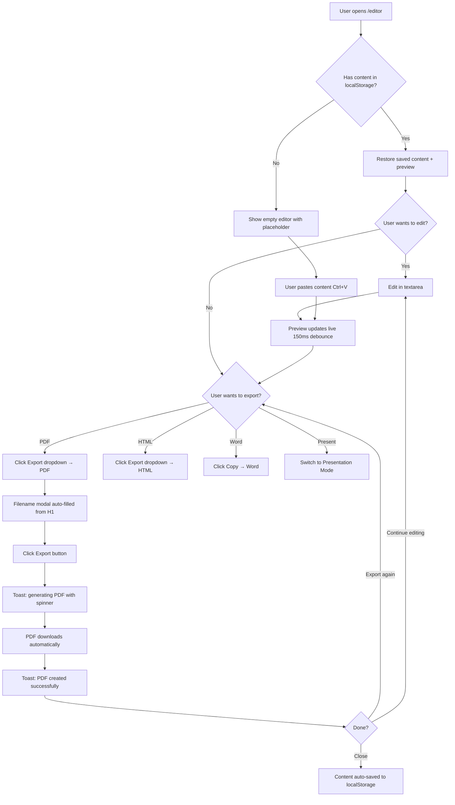
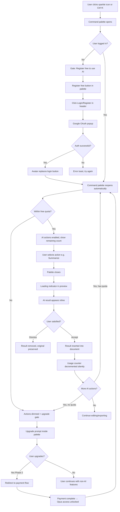
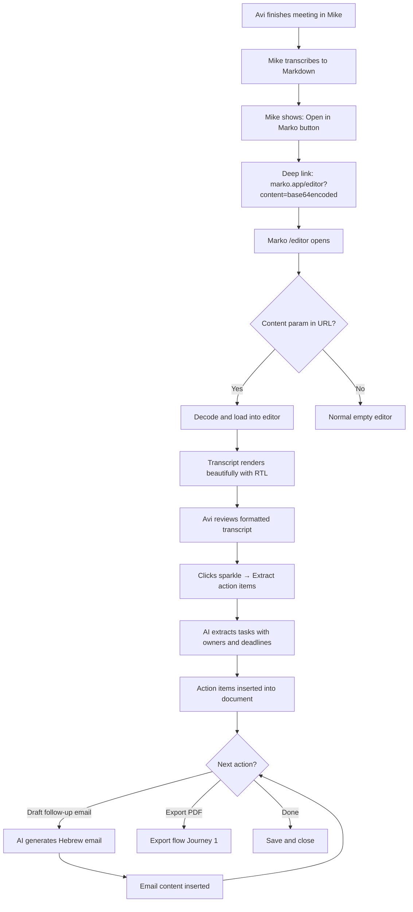

# UX Design Specification Marko

**Author:** BenAkiva
**Date:** 2026-03-06

---

<!-- UX design content will be appended sequentially through collaborative workflow steps -->

## Executive Summary

### Project Vision

Marko evolves hebrew-markdown-export (v1.3.0) — a beloved single-file Hebrew Markdown editor — into a freemium SaaS platform. The core experience remains "paste or type Markdown, get beautiful output instantly." On top of this foundation, Marko adds contextual AI document actions (summarize, translate, extract action items), user authentication with tiered access, and a trust-first monetization model where free users never lose what they have.

The product targets Hebrew-speaking professionals, students, and content creators who need fast, polished document formatting without heavyweight tools. Marko's key differentiator is Hebrew-native bilingual intelligence: automatic per-sentence RTL/LTR detection that no other Markdown tool provides. The AI layer positions Marko not as a chatbot but as a document companion that understands context and proposes relevant actions.

Marko is part of a broader ecosystem: future integration with Mike (a transcription agent) creates a voice-to-structured-document pipeline.

### Target Users

**Primary Personas:**

- **Noa (Paste-and-Present Professional):** 34, project manager. Receives Markdown from AI tools and developer docs. Doesn't write Markdown — consumes it. Needs instant rendering, presentation mode, and PDF export. Conversion trigger: AI translation for international stakeholders.

- **Yuval (Hebrew-Writing Developer):** 28, full-stack developer. Writes technical documentation in Hebrew. Needs code blocks, Mermaid diagrams, and Hebrew prose to coexist with correct directionality. Conversion trigger: AI action extraction from specs.

- **Dana (Existing v1 User):** 41, content writer. Weekly user for 6 months. Values simplicity, speed, and beauty. Must experience v2 as a seamless evolution. Conversion trigger: gradual AI discovery through free trial calls.

- **Avi (Pipeline User):** 52, consultant. Uses Mike for transcription, needs Marko to format and act on transcripts. Conversion trigger: AI-powered meeting action extraction and follow-up drafting.

- **BenAkiva (Operator):** Product owner. Needs analytics dashboard, cost monitoring, conversion tracking, and SEO visibility.

**User Characteristics:**
- Tech comfort ranges from intermediate (Noa, Dana) to advanced (Yuval)
- Primary device: desktop/laptop (editor is inherently a two-panel layout)
- Secondary device: tablet/mobile for quick viewing
- Usage context: work hours, often under time pressure ("present this in 15 minutes")
- Hebrew-first, with frequent Hebrew-English mixing in professional contexts

### Key Design Challenges

1. **Migration Trust Gap:** v1 users must experience v2 as an evolution, not a replacement. Visual continuity, settings migration, and zero feature regression are critical. The transition moment — opening a bookmark and seeing "Marko" — must feel familiar and welcoming.

2. **AI Discoverability vs. Toolbar Simplicity:** The toolbar must remain minimal (a core brand promise), yet AI features need enough visibility to create the "wow moment" that drives conversion. Too prominent risks clutter; too hidden means features are never found.

3. **Three-Tier Progressive Disclosure:** Anonymous, free registered, and paid users see different capabilities. Tier boundaries (especially the AI usage limit and upgrade prompt) must feel informative and fair, never punitive or confusing.

4. **Bilingual Layout Complexity:** Per-sentence RTL/LTR auto-detection is novel and powerful when it works. Mixed-language edge cases (code comments in English within Hebrew prose) need graceful manual override without breaking the "just works" feeling.

5. **Desktop-First, Mobile-Aware:** The two-panel editor is inherently desktop-optimized. Mobile requires a fundamentally different layout (stacked panels with toggle), not a compressed version of the desktop experience.

### Design Opportunities

1. **"Paste and Wow" Onboarding:** No signup wall, no tutorial needed. The first interaction IS the product demo — paste content, see beautiful output instantly. This zero-friction onboarding is rare and builds immediate trust.

2. **AI as Contextual Document Companion:** Unlike generic AI chatbots, Marko's AI understands the document's content and purpose. It can detect a meeting transcript and offer "extract action items" or recognize a bilingual document and suggest translation — contextual intelligence that feels magical.

3. **Presentation Mode as Differentiator:** Most Markdown tools optimize for writing. Marko repositions as a viewer and presenter for machine-generated Markdown. Full-screen, distraction-free, beautifully rendered presentation from pasted content is a unique and compelling UX proposition.

## Core User Experience

### Defining Experience

Marko is a **paste-first document companion**. Users do not write Markdown from scratch — they paste content from AI tools (ChatGPT, Claude, Copilot), developer documentation, transcription services, or their own drafts, then continue working: reviewing, editing, theming, and exporting.

The core loop is: **Paste → See beautiful output → Refine → Export**

This positions Marko as a content receiver and refiner, not a blank-page writing tool. The editor exists for light edits and formatting adjustments, not for composition. Every UX decision must optimize for this paste-first workflow.

### Platform Strategy

- **Primary platform:** Desktop/laptop web browser (Chrome, Firefox, Edge, Safari — latest 2 versions)
- **Architecture:** SPA with SSR landing page for SEO. Single editor route, no page transitions.
- **Mobile:** Responsive web (not native app). Stacked single-panel layout with view mode toggle. Touch-friendly toolbar with overflow menu. Mobile is for viewing and light interaction, not primary editing.
- **Tablet:** Stacked panels with toggle, intermediate between desktop and mobile.
- **Offline:** Core editor and export functions work offline (PWA with service worker). AI features require network.
- **Input method:** Primarily keyboard and mouse. Paste (Ctrl+V / Cmd+V) is the most important input action. Touch support for mobile viewing and basic interaction.
- **Breakpoints:** 1024px (tablet landscape), 768px (tablet portrait), 640px (large phone), 480px (small phone), desktop default.

### Effortless Interactions

These interactions must require zero thought and feel instant:

1. **Paste to preview:** User pastes content → rendered preview appears in under 100ms with correct RTL/LTR per sentence, formatted headings, styled code blocks, and rendered Mermaid diagrams. No configuration, no toggle, no delay.

2. **PDF export with smart page breaks:** One-click export produces a professional PDF where pages break at logical boundaries — before headings (H1-H3), tables are never split across pages, code blocks stay together, and the user's color theme is preserved. No manual page break management needed.

3. **Color theming:** Select a preset or extract colors from an image — the entire preview updates live. Exports (PDF, HTML, Word) inherit the active theme without additional configuration.

4. **RTL/LTR auto-detection:** Invisible to the user. Hebrew text flows right-to-left, English text flows left-to-right, code blocks stay LTR — all per-sentence, all automatic. Manual override available at document level but rarely needed.

5. **Format preservation across exports:** What you see in the preview is what you get in PDF, HTML, and Word. Colors, direction, diagrams, and typography are consistent across all output formats.

### Critical Success Moments

1. **The Paste Moment (Trust Builder):** Content appears in the preview, beautifully rendered, in under 1 second. Hebrew flows right-to-left. English stays left-to-right. Code blocks are highlighted. Mermaid diagrams render inline. The user thinks: "This just works." If this moment fails, nothing else matters.

2. **The PDF Export Moment (Value Proof):** The exported PDF looks professional — pages break at chapter boundaries, tables stay intact, headings never orphan at page bottoms, and the user's color theme is preserved. The user thinks: "I didn't have to fix anything." This is where Marko proves it's not just a preview tool but a production-quality document pipeline.

3. **The Dana Moment (Migration Trust):** A v1 user opens their bookmark. The tool looks refreshed but familiar. Their saved colors are preserved. Their workflow is unchanged. A subtle welcome message acknowledges the evolution. The user thinks: "They didn't break it." This moment determines whether the existing user base stays or leaves.

4. **The AI Discovery Moment (Conversion Trigger):** A registered user clicks the AI button for the first time. The AI analyzes their actual document and produces a genuinely useful result — a summary, a translation, extracted action items. The user thinks: "This understood my document." This moment doesn't build core trust (that's the paste moment) but it builds willingness to pay.

### Experience Principles

1. **Paste is the front door.** Every design decision assumes content arrives via paste. The editor is for refinement, not composition. Optimize for the paste-to-preview pipeline above all else.

2. **Beautiful output, zero configuration.** The default experience must produce professional-quality results without any settings changes. Themes, presets, and customization exist for power users — but the out-of-box experience must already be excellent.

3. **Export is a first-class feature, not an afterthought.** PDF export with intelligent page breaking, preserved themes, and correct RTL is core product value — not a secondary utility. The quality of the exported document is as important as the quality of the live preview.

4. **Simplicity is sacred.** The toolbar stays minimal. Features are discoverable but never cluttering. AI lives behind a single entry point. Advanced options exist but are progressive — visible only when relevant. If adding a feature makes the default experience more complex, the feature needs redesigning.

5. **Trust through continuity.** Every v1 feature works in v2. Settings migrate automatically. The visual language evolves but doesn't break. Free users never lose capabilities. Upgrade prompts inform, never pressure.

## Desired Emotional Response

### Primary Emotional Goals

1. **Confidence:** Users feel certain their output will look professional without needing to fiddle with settings, fix layout issues, or manually adjust direction. Marko handles it. They paste, they trust, they export.

2. **Professionalism:** After exporting a PDF, users feel their document reflects well on them — it looks like it was produced with a proper publishing tool, not a quick web editor. The output elevates their content.

3. **Home:** Hebrew speakers feel this tool was made *for them*. Not adapted, not localized as an afterthought — built Hebrew-first. The RTL just works. The UI speaks their language. Other Markdown tools feel foreign; Marko feels native.

### Emotional Journey Mapping

| Stage | Desired Emotion | Design Implication |
|---|---|---|
| **First visit** | Curiosity → Instant satisfaction | No signup wall. Paste works immediately. Beautiful output in under 1 second. |
| **Paste moment** | Impressed confidence | RTL/LTR auto-detection just works. No toggles needed. "This gets me." |
| **Editing/refining** | Calm focus | Minimal UI. No clutter. Toolbar stays out of the way. |
| **PDF export** | Professional pride | Smart page breaks, preserved colors, correct RTL. "I didn't fix anything." |
| **Sharing the PDF** | "This looks great" (from others) | The exported document speaks for itself — others notice the quality. |
| **AI first use** | Pleasant surprise | The AI understood *their* document and did something useful. Not generic. |
| **Hitting free AI limit** | Informed, not pressured | Clear, fair message. No guilt. No feature degradation. Easy to dismiss. |
| **Returning next time** | Familiarity, comfort | Everything is where they left it. Content saved. Colors preserved. |
| **Something goes wrong** | Reassured, not abandoned | Graceful degradation. Clear error messages in Hebrew. Nothing breaks silently. |

### Micro-Emotions

**Critical positive micro-emotions:**
- **Trust** over skepticism — the tool does what it promises, every time. No surprises.
- **Accomplishment** over frustration — tasks complete quickly with professional results.
- **Confidence** over confusion — the UI is self-evident. No need to search for features.

**Critical negative emotions to prevent:**
- **Betrayal** — "They ruined my tool." v1 users must never feel this. Zero feature regression.
- **Pressure** — "They're forcing me to pay." Upgrade prompts must inform, never guilt or block.
- **Confusion** — "Where did my feature go?" or "What does this button do?" Every interaction must be self-explanatory.
- **Embarrassment** — "The PDF looks broken." Export quality failures directly hurt user trust and professional reputation.

### Design Implications

| Emotional Goal | UX Design Approach |
|---|---|
| Confidence | Instant preview rendering (<100ms). WYSIWYG export fidelity. No "did it work?" moments. |
| Professionalism | Smart PDF page breaks by default. Color themes that look polished out of the box. Typography that reads well in print. |
| Home (Hebrew-native) | RTL as default direction. All UI text in Hebrew. Hebrew ARIA labels. Direction auto-detection that handles real Hebrew/English mixing. |
| Pleasant surprise (AI) | AI results appear inline, contextual to the document. No generic chatbot UI. Actions like "summarize" and "extract action items" feel like natural document operations. |
| No pressure (monetization) | Contextual upgrade prompt inside the AI command palette (not a banner). Free tier is fully functional for core features. AI limit message shows remaining value, not loss. |
| Reassurance (errors) | Graceful degradation: AI down → banner, not broken UI. PDF generation → progress indicator. Mermaid parse error → friendly message, not blank space. |

### Emotional Design Principles

1. **Professional by default.** Every output — preview, PDF, HTML, Word — must look like it was produced by a professional tool. Users stake their reputation on Marko's output when they share exported documents.

2. **Respect over persuasion.** Never guilt users into paying. Never hide features they had before. Never interrupt their workflow with upgrade prompts. Show value, let them decide. The tool earns money by being genuinely useful, not by creating artificial friction.

3. **Hebrew is home, not a setting.** The emotional experience of a Hebrew-speaking user should be: "Finally, a tool that gets me." RTL is not a toggle — it's the default. Hebrew labels are not translations — they're the primary language. This emotional home extends to every detail.

4. **Invisible complexity.** Users should feel the tool is simple even when it's doing complex things (per-sentence language detection, intelligent model routing, smart page breaking). Complexity happens behind the scenes; the user feels only the result.

5. **Reliability breeds loyalty.** Users return because Marko *always works*. Content is always saved. Export always looks right. RTL always flows correctly. Consistency over time builds the deepest emotional bond — not features, not AI, but dependable excellence.

## UX Pattern Analysis & Inspiration

### Inspiring Products Analysis

**Primary Inspiration: hebrew-markdown-export v1.3.0 (the current tool)**

The strongest UX inspiration for Marko v2 is the existing v1 tool itself. Users already love it. The creator is deeply satisfied with its look and feel. This is rare and valuable — most products start from dissatisfaction. Marko starts from a position of strength.

**What v1 does well:**
- Instant paste-to-preview with beautiful rendering
- Clean, minimal two-panel layout that doesn't overwhelm
- 15 color presets + image color extraction that make theming feel playful and powerful
- Hebrew RTL as the natural default, not an afterthought
- Varela Round (body) + JetBrains Mono (code) font pairing — friendly yet professional
- Color customization panel that slides out without disrupting the workflow
- Dark/light mode with consistent theming across both
- Export system that preserves the preview's visual identity

**What keeps users coming back:**
- Speed — paste and see results in under a second
- Visual quality — the rendered output genuinely looks good
- Simplicity — no account needed, no setup, no learning curve
- Reliability — it always works, content is always saved

**Secondary Inspiration: shadcn/ui Component System**

The technology migration to shadcn/ui is confirmed. shadcn/ui provides:
- Accessible, composable components with RTL support via Radix UI primitives
- Consistent interaction patterns (dropdowns, modals, tooltips, buttons)
- CSS variable-based theming that aligns perfectly with Marko's existing 17-property color system
- Dark/light mode built into the system
- Professional component quality that elevates perceived polish without changing the visual identity

### Transferable UX Patterns

**From v1 (Preserve):**

| Pattern | What to Keep | Why |
|---|---|---|
| Two-panel split layout | Editor left, preview right, with view mode toggles | Users know and love this layout. It's the core spatial model. |
| Slide-out color panel | Right-side panel that overlays without navigation | Non-disruptive customization. Users can tweak and see results live. |
| Preset grid | Visual gradient buttons for theme selection | Intuitive, playful, and fast. No dropdown menus or text lists. |
| Toolbar grouping | Logical groups (text, headings, lists, insert, code, mermaid) with separators | Familiar structure that scales. Users know where to find tools. |
| Inline SVG icons | Custom icons that match the visual language | Consistent visual identity without icon library dependencies. |
| Toast notifications | Bottom-center, auto-dismiss | Non-intrusive feedback that doesn't block workflow. |
| Modal system | Centered overlay for link/image/table/export inputs | Focused input moments with clear escape paths. |

**From shadcn/ui (Adopt):**

| Pattern | What to Adopt | Why |
|---|---|---|
| Command palette (cmdk) | Keyboard-driven AI action menu | Perfect for AI feature discoverability — press a shortcut, type an action. Minimal, powerful, non-cluttering. |
| Sheet component | Slide-out panels with proper focus trapping | Evolves the color panel with better accessibility and animation. |
| Dialog component | Accessible modals with proper focus management | Replaces current modals with WCAG-compliant versions. |
| Dropdown menu | Consistent dropdown behavior with keyboard navigation | Improves header action dropdowns with proper a11y. |
| Toast (Sonner) | Rich toast notifications with actions | Evolves the current toast with progress indicators (for PDF generation) and action buttons. |
| Tooltip | Accessible tooltips with proper positioning | Replaces the custom global tooltip with a component that handles RTL positioning natively. |

### Anti-Patterns to Avoid

1. **"New tool syndrome"** — Redesigning the UI just because we're migrating frameworks. Users don't want a new tool; they want their tool, improved. Every visual change must be justified by a real UX improvement, not by "we're using a new framework now."

2. **Feature-driven clutter** — Adding AI features, authentication UI, and upgrade prompts to the toolbar. The toolbar must remain as clean as v1. New capabilities live in dedicated, non-intrusive entry points.

3. **Generic SaaS chrome** — Adding a top navigation bar with "Home / Pricing / Docs / Login" that makes Marko feel like every other SaaS app. Marko is a tool, not a website. The editor IS the home page.

4. **Chatbot UI for AI** — A chat sidebar or message-bubble interface for AI features. Marko's AI is a document action system, not a conversation partner. Actions produce results inline, not in a chat thread.

5. **Heavy onboarding flows** — Signup wizards, feature tours, or tooltip walkthroughs. The product is self-evident. Paste works immediately. Features are discoverable through natural exploration.

6. **Paywall interruptions** — Modal popups that block the workflow when a user tries an AI feature without being logged in. Use inline, dismissible prompts instead.

### Design Inspiration Strategy

**Core Strategy: Preserve the soul, elevate the craft.**

**What to Preserve (Non-Negotiable):**
- Color palette system (17 properties, 15 presets, image extraction)
- Font pairing: Varela Round (body) + JetBrains Mono (code)
- Two-panel layout with view mode toggles
- Slide-out color customization panel
- Toolbar structure and grouping logic
- Dark/light mode visual identity
- Overall spacing, proportions, and visual rhythm

**What to Elevate (via shadcn/ui):**
- Component accessibility (focus management, ARIA labels, keyboard navigation)
- Animation quality (smooth transitions, micro-interactions)
- Modal and dropdown behavior (proper focus trapping, escape handling)
- Toast system (progress indicators for PDF generation, action buttons)
- Tooltip system (RTL-aware positioning, accessible)

**What to Add (New in v2):**
- AI action entry point (single sparkle icon in toolbar → command palette)
- Authentication UI (minimal — avatar/login button in header, not a navigation bar)
- Upgrade prompt (contextual, inside the AI command palette only)
- Presentation mode (full-screen, distraction-free preview)
- PDF export dialog (smart defaults with optional advanced controls)

## Design System Foundation

### Design System Choice

**shadcn/ui** on **Next.js** — a themeable, accessible component system with full ownership of source code, running on the dominant React framework for hybrid SSR/SPA applications.

### Rationale for Selection

| Decision Factor | How shadcn/ui + Next.js Addresses It |
|---|---|
| **Preserve v1 visual identity** | CSS variable-based theming maps directly to Marko's 17-property color system. Fonts, colors, spacing, and dark/light mode are preserved through theme configuration, not component overrides. |
| **Accessibility (WCAG AA)** | Radix UI primitives provide focus management, keyboard navigation, ARIA labels, and RTL support out of the box. Hebrew ARIA labels are configurable per component. |
| **Solo developer velocity** | Copy-paste component ownership — no abstraction layers, no framework lock-in. Components live in the codebase, fully customizable. Next.js provides routing, API routes, and SSR with zero config. |
| **Hybrid rendering** | Next.js serves SSR/SSG landing page for SEO while the editor route runs as a client-side SPA for performance. Per-route rendering strategy with no compromise. |
| **Backend needs** | Convex handles AI proxy (actions), auth webhooks (Clerk), payment webhooks, and analytics — all as serverless functions alongside the Next.js frontend. No separate server. |
| **shadcn/ui first-class support** | Next.js has the strongest shadcn/ui integration, including Server Components compatibility for the landing page. |
| **Community & longevity** | Next.js holds 67% React framework market share (2026). shadcn/ui is the most popular React component collection. Both have large, active communities. |

### Implementation Approach

**Framework Stack:**
- **Next.js 15+** — App Router with hybrid rendering (SSR for landing, client for editor)
- **shadcn/ui** — Component library (copied into project, full ownership)
- **Tailwind CSS** — Utility-first styling with RTL support via `dir` attribute
- **Radix UI** — Accessibility primitives (underlying shadcn/ui)
- **Sonner** — Toast notifications with progress indicators
- **cmdk** — Command palette for AI action menu

**Rendering Strategy:**
- `/` (landing page) — SSG/ISR for SEO. Server Components for fast load.
- `/editor` (main app) — Client-side rendering. SPA behavior. No SSR needed.
- `/api/*` (backend) — API routes for AI proxy, auth, payments, analytics.

**RTL Integration:**
- `dir="rtl"` on root `<html>` element as default
- Tailwind's RTL plugin for directional utilities (`ms-`, `me-` instead of `ml-`, `mr-`)
- Radix UI primitives respect `dir` attribute natively
- shadcn/ui components inherit RTL behavior without custom overrides

### Customization Strategy

**Theme Layer (CSS Variables):**
Map Marko's existing 17-property color system to shadcn/ui's CSS variable convention:

| Marko v1 Property | shadcn/ui CSS Variable | Purpose |
|---|---|---|
| `primaryText` | `--foreground` | Main text color |
| `secondaryText` | `--muted-foreground` | Secondary text |
| `link` | `--primary` | Links and primary accent |
| `code` | `--code-foreground` | Inline code text |
| `h1`, `h2`, `h3` | `--heading-1`, `--heading-2`, `--heading-3` | Heading colors (custom extension) |
| `h1Border`, `h2Border` | `--heading-1-border`, `--heading-2-border` | Heading underlines (custom extension) |
| `previewBg` | `--card` | Preview panel background |
| `codeBg` | `--code-background` | Code block background |
| `blockquoteBg` | `--blockquote-background` | Blockquote background |
| `blockquoteBorder` | `--blockquote-border` | Blockquote left border |
| `tableHeader` | `--table-header` | Table header background |
| `tableAlt` | `--table-alt` | Table alternating row |
| `tableBorder` | `--table-border` | Table border color |
| `hr` | `--border` | Horizontal rule color |

**Font Configuration:**
- Body: Varela Round via `next/font/google` (optimized loading, no layout shift)
- Code: JetBrains Mono via `next/font/google`
- Both fonts configured in Tailwind theme, inherited by all shadcn/ui components

**Component Customization Priority:**
1. Theme variables first — change colors/fonts via CSS variables, not component code
2. Tailwind classes second — override spacing, sizing, layout via utility classes
3. Component source last — modify component internals only when theme + utilities aren't sufficient

**15 Color Presets:**
All existing presets (classic, ocean, forest, sunset, mono, lavender, rose, gold, teal, night, ruby, sakura, mint, coffee, sky) migrate as theme variable sets. Switching presets updates CSS variables at runtime — same mechanism as v1, same instant preview update.

## Defining Experience

### The One-Line Description

**"Paste Markdown, get a beautiful Hebrew document, export a perfect PDF."**

This is what users tell their friends. Three actions, zero friction, professional results.

### User Mental Model

**How users currently solve this problem:**

| Current Approach | Pain Points |
|---|---|
| Paste Markdown into online editors (StackEdit, Dillinger, etc.) | Hebrew RTL breaks completely. Mixed Hebrew/English is a disaster. |
| Copy AI output into Google Docs / Word | Spend 10-15 minutes fixing formatting, direction, and styles manually. |
| Use the current v1 tool | Core editing and preview works great. PDF export via browser print dialog is the pain point — inconsistent output, no theme preservation, ugly page breaks. |
| Screenshot the preview and share as image | Workaround for broken PDF. Loses text selectability, quality degrades. |

**Mental model users bring:**
- "I paste, it should look good" — they expect instant visual results, like pasting into a rich text editor
- "Export should match what I see" — WYSIWYG expectation. The preview is the promise; the PDF is the delivery.
- "Hebrew should just work" — they've been burned so many times by tools that break RTL that they expect failure. When it works, it's a surprise.
- "I don't want to configure anything" — they're not Markdown power users configuring parsers. They paste and go.

### Success Criteria

**The core interaction succeeds when:**

1. **Paste → Preview in <1 second.** Content appears rendered with correct RTL/LTR per sentence, styled headings, highlighted code blocks, and rendered Mermaid diagrams. No configuration step between paste and beautiful output.

2. **Preview = PDF.** The exported PDF is visually identical to the preview — same colors, same fonts, same direction, same diagrams. Users never open the PDF and think "this doesn't match."

3. **Smart page breaks without user intervention.** Pages break before H1-H3 headings. Tables are never split across pages. Code blocks stay together. Headings never orphan at page bottoms. Users don't think about pagination — it just looks right.

4. **Zero-error RTL.** Hebrew text flows right-to-left. English text and code flow left-to-right. Mixed sentences handle correctly. Users never manually toggle direction.

5. **One-click export.** Click export → filename modal (auto-suggested from first heading) → PDF downloads. Two interactions total: click and confirm.

### Novel UX Patterns

**1. Per-Sentence RTL/LTR Auto-Detection (Novel — Invisible)**

No existing Markdown tool does this. Marko analyzes Unicode character composition per sentence and applies the correct `dir` attribute automatically.

- **UX approach:** Completely invisible. No toggle, no indicator, no setting. It just works.
- **Fallback:** Document-level direction override toggle in toolbar (existing v1 pattern) for edge cases.
- **Education needed:** None. Users notice it works; they don't need to know how.

**2. AI Document Actions via Command Palette (Novel Combination)**

AI features accessed through a command palette (cmdk) — not a chatbot, not a sidebar.

- **UX approach:** Sparkle icon in toolbar + keyboard shortcut (Ctrl+K or Cmd+K). Opens command palette with contextual AI actions.
- **Discovery cue:** Sparkle icon with Hebrew tooltip "שאל את מארקו AI". Subtle but visible in the toolbar's natural scan path.
- **Education needed:** Minimal. The sparkle icon is a recognized AI affordance (2026). The command palette pattern is familiar to power users. First-time users get a brief inline hint.

**3. Smart PDF Page Breaking (Established Pattern, Automatic Application)**

Publishing tools (InDesign, LaTeX) use intelligent page breaking. Marko applies these rules automatically.

- **UX approach:** Zero-config smart defaults. Pages break before headings, tables and code blocks stay together, orphan/widow prevention.
- **Advanced users (Phase 3):** Optional manual page break syntax (`---pagebreak---`) and pre-export controls (margin size, paper format).
- **Education needed:** None. Users expect good page breaks; they notice when they're bad.

### Experience Mechanics

**Flow 1: Paste → Preview (The Trust Builder)**

```
1. INITIATION
   User arrives at /editor
   → Empty editor with placeholder text: "...הדבק טקסט מארקדאון כאן" (Paste Markdown here...)
   → Preview panel shows empty state or gentle prompt

2. INTERACTION
   User presses Ctrl+V / Cmd+V (or clicks paste button)
   → Content appears in editor textarea

3. SYSTEM RESPONSE (< 100ms)
   → Debounce timer (150ms) triggers renderMarkdown()
   → Marked.js parses Markdown → raw HTML
   → Per-sentence RTL/LTR detection runs on each text node
   → Mermaid blocks detected and rendered as diagrams
   → Highlight.js applies syntax coloring to code blocks
   → Preview panel displays fully rendered, styled output

4. FEEDBACK
   → Preview panel scrolls to match editor position
   → Beautiful output confirms "this is working"
   → No success toast needed — the visual result IS the feedback

5. COMPLETION
   → User sees their content rendered beautifully
   → They can scroll, review, or switch to preview-only mode
   → Natural next action: export or refine
```

**Flow 2: Export → PDF (The Value Proof)**

```
1. INITIATION
   User clicks "ייצא" (Export) dropdown in header
   → Dropdown shows: PDF | HTML | Markdown

2. INTERACTION
   User selects PDF
   → Export filename modal appears
   → Filename pre-filled from first heading (e.g., "סיכום-פגישה.pdf")
   → User can edit filename or accept default

3. SYSTEM RESPONSE
   User clicks "ייצא" (Export) button in modal
   → Modal closes
   → Toast appears: "...מייצר PDF" with progress indicator (Sonner)
   → html2pdf.js generates PDF:
     - Resolves all CSS variables to computed values
     - Renders Mermaid diagrams as rasterized images (html2canvas)
     - Applies smart page break rules:
       • page-break-before on H1-H3
       • page-break-inside: avoid on tables, code blocks, blockquotes
       • Orphan/widow prevention on paragraphs
     - Preserves RTL direction throughout
     - Applies current color theme inline
   → PDF downloads automatically

4. FEEDBACK
   → Progress toast updates: "...מייצר PDF" → "!PDF נוצר בהצלחה" (PDF created successfully)
   → Toast auto-dismisses after 3 seconds
   → Browser shows download notification

5. COMPLETION
   → PDF is in user's downloads folder
   → Ready to share, email, or present
   → User can immediately export again with different settings or continue editing
```

**Flow 3: AI Action (The Conversion Trigger)**

```
1. INITIATION
   User clicks sparkle icon in toolbar OR presses Ctrl+K / Cmd+K
   → Command palette opens (cmdk)
   → Shows contextual AI actions based on document content:
     "סכם את המסמך" (Summarize document)
     "תרגם לאנגלית" (Translate to English)
     "חלץ משימות" (Extract action items)
     "שפר ניסוח" (Improve writing)

2. GATE CHECK
   If anonymous user → Inline prompt in palette: "הירשם בחינם כדי להשתמש ב-AI" (Register free to use AI)
   If free user at limit → Inline prompt: "ניצלת X מתוך Y פעולות AI החודש" (Used X of Y AI actions this month)
   If registered with quota → Proceed

3. INTERACTION
   User selects an action (click or type to filter + Enter)
   → Command palette closes
   → Inline loading indicator appears in preview area
   → System routes to appropriate model (Haiku/Sonnet) invisibly

4. SYSTEM RESPONSE (< 10 seconds for Sonnet)
   → AI processes document content
   → Result appears inline:
     - Summary: rendered Markdown block inserted at cursor or shown in result panel
     - Translation: section replaced or shown side-by-side
     - Action items: bullet list generated and inserted
     - Writing improvements: suggestions shown as inline annotations

5. FEEDBACK
   → Result appears with subtle highlight animation
   → Toast: "AI סיים לעבד" (AI finished processing)
   → User can accept, edit, or dismiss the result

6. COMPLETION
   → AI result is part of the document (if accepted)
   → User can continue editing, export, or invoke another AI action
   → Usage counter updates silently
```

## Visual Design Foundation

### Color System

**Architecture: 17-Property Dynamic Color Model**

Marko's color system is a proven, user-loved design. It migrates to v2 unchanged in structure, with CSS variable implementation upgraded for shadcn/ui compatibility.

**Color Properties (17 total):**

| Category | Properties | Purpose |
|---|---|---|
| **Text (4)** | primaryText, secondaryText, link, code | Body text, muted text, hyperlinks, inline code |
| **Headings (5)** | h1, h1Border, h2, h2Border, h3 | Heading text colors and decorative underlines |
| **Backgrounds (5)** | previewBg, codeBg, blockquoteBg, tableHeader, tableAlt | Surface colors for content containers |
| **Accents (3)** | blockquoteBorder, hr, tableBorder | Border and divider colors |

**Default Theme (Classic):**
- Primary accent: `#10B981` (emerald green)
- Text: dark grays on light backgrounds
- Headings: graduated greens (H1 darkest → H3 lightest)
- Backgrounds: white preview, light gray code blocks
- Borders: subtle greens matching the accent

**15 Built-In Presets:**
classic, ocean, forest, sunset, mono, lavender, rose, gold, teal, night, ruby, sakura, mint, coffee, sky — each a complete 17-property set with a distinct personality. All preserved exactly as v1.

**Image Color Extraction:**
Users upload any image → k-means clustering extracts 6 dominant colors → automatic mapping to 17 properties based on luminance and saturation → live preview before applying. This feature migrates unchanged.

**Dark/Light Mode:**
Both modes defined as complete CSS variable sets in `:root` and `[data-theme="dark"]`. Switching modes updates all UI chrome colors while preserving the user's content color preset. Dark mode uses the same 15 presets with adjusted background values.

**Accessibility Compliance:**
- All text/background combinations must meet WCAG AA contrast ratio (4.5:1 minimum)
- The default classic theme passes AA. Custom presets and image-extracted themes should be validated against contrast requirements.
- Phase 3: Add WCAG contrast validation to image color extraction with automatic adjustment for failing pairs.

### Typography System

**Font Pairing (Preserved from v1):**

| Role | Font | Weight | Usage |
|---|---|---|---|
| **Body** | Varela Round | 400 (regular) | All UI text, preview body text, buttons, labels |
| **Code** | JetBrains Mono | 400, 700 | Inline code, code blocks, Mermaid diagram text |

**Rationale:** Varela Round is a rounded sans-serif that reads beautifully in Hebrew — friendly and approachable without being childish. JetBrains Mono is a developer-standard monospace with excellent Hebrew character support and ligatures.

**Type Scale (Preview Content):**

| Element | Size | Weight | Line Height | Letter Spacing |
|---|---|---|---|---|
| H1 | 2em | 700 | 1.3 | normal |
| H2 | 1.5em | 700 | 1.35 | normal |
| H3 | 1.25em | 700 | 1.4 | normal |
| H4 | 1.1em | 700 | 1.4 | normal |
| H5 | 1em | 700 | 1.4 | normal |
| H6 | 0.9em | 700 | 1.4 | normal |
| Body | 1em (16px base) | 400 | 1.7 | normal |
| Code inline | 0.9em | 400 | inherit | normal |
| Code block | 0.85em | 400 | 1.6 | normal |
| Blockquote | 1em | 400 italic | 1.7 | normal |

**UI Type Scale (Chrome):**

| Element | Size | Usage |
|---|---|---|
| Header logo | 1.1rem | "Marko" brand text |
| Toolbar labels | 0.75rem | Button tooltips, dropdown items |
| Panel headers | 0.85rem | "עורך" / "תצוגה מקדימה" panel titles |
| Toast text | 0.875rem | Notification messages |
| Modal titles | 1.1rem | Dialog headings |
| Modal body | 0.9rem | Input labels, descriptions |

**Font Loading Strategy:**
- `next/font/google` for both Varela Round and JetBrains Mono
- `font-display: swap` for immediate text rendering
- Fonts preloaded via Next.js automatic optimization — no layout shift
- Fallback: system sans-serif (for body), system monospace (for code)

### Spacing & Layout Foundation

**Base Unit: 4px**

All spacing derives from a 4px base unit. This matches v1's existing rhythm and provides enough granularity for dense UI without creating inconsistency.

**Spacing Scale:**

| Token | Value | Usage |
|---|---|---|
| `space-1` | 4px | Tight gaps (icon padding, inline spacing) |
| `space-2` | 8px | Standard element padding |
| `space-3` | 12px | Component internal padding |
| `space-4` | 16px | Section gaps, card padding |
| `space-5` | 20px | Panel padding |
| `space-6` | 24px | Section separation |
| `space-8` | 32px | Major section breaks |

**Layout Structure:**

```
┌─────────────────────────────────────────────────────────┐
│ Header (fixed, 48px height)                              │
│ [Logo] [View Toggles]          [Actions] [Theme] [Auth] │
├─────────────────────────────────────────────────────────┤
│ Main (fills remaining viewport height)                   │
│ ┌──────────────────────┬──────────────────────────────┐ │
│ │ Editor Panel (50%)   │ Preview Panel (50%)          │ │
│ │ ┌──────────────────┐ │ ┌──────────────────────────┐ │ │
│ │ │ Toolbar (sticky) │ │ │ Panel Header             │ │ │
│ │ ├──────────────────┤ │ ├──────────────────────────┤ │ │
│ │ │                  │ │ │                          │ │ │
│ │ │ Textarea         │ │ │ Rendered Preview         │ │ │
│ │ │ (scrollable)     │ │ │ (scrollable)             │ │ │
│ │ │                  │ │ │                          │ │ │
│ │ └──────────────────┘ │ └──────────────────────────┘ │ │
│ └──────────────────────┴──────────────────────────────┘ │
├─────────────────────────────────────────────────────────┤
│ Footer (minimal, 32px)                                   │
└─────────────────────────────────────────────────────────┘
```

**Grid System:**
- CSS Grid for main two-panel layout: `grid-template-columns: 1fr 1fr`
- Editor-only mode: `grid-template-columns: 1fr 0fr`
- Preview-only mode: `grid-template-columns: 0fr 1fr`
- Panel resize handle between editor and preview (optional v2 enhancement)

**Density: Same as v1**
The current density is correct — not too spacious, not too cramped. The tool is a workspace, not a marketing page. Dense enough to maximize content area, spacious enough that controls don't feel crowded.

**Responsive Behavior:**

| Breakpoint | Layout | Changes |
|---|---|---|
| Desktop (>1024px) | Two-panel side-by-side | Full experience. Editor + preview. |
| Tablet landscape (768-1024px) | Stacked panels with toggle | Panels stack vertically. Toggle between editor/preview. |
| Tablet portrait (640-768px) | Single panel with toggle | One panel visible at a time. Toolbar collapses to overflow menu. |
| Mobile (480-640px) | Single panel, compact toolbar | Touch-optimized. Larger tap targets. Reduced toolbar items. |
| Small mobile (<480px) | Single panel, minimal toolbar | Essential actions only. View mode toggle prominent. |

### Accessibility Considerations

**WCAG AA Compliance Requirements:**

| Area | Requirement | Implementation |
|---|---|---|
| **Color contrast** | 4.5:1 text/background ratio | All 15 presets validated. Custom themes get a contrast warning. |
| **Focus indicators** | Visible focus ring on all interactive elements | shadcn/ui default focus rings, customized to match Marko's accent color |
| **Keyboard navigation** | Full functionality without mouse | Tab order follows visual layout. All dropdowns/modals keyboard-accessible via Radix UI. |
| **ARIA labels** | All controls labeled in Hebrew | Every toolbar button, modal, panel, and interactive element has `aria-label` in Hebrew. |
| **Focus trapping** | Modals trap focus; return focus on close | Radix UI Dialog handles this natively. |
| **Screen reader** | Preview output is semantic HTML | Headings, lists, tables, blockquotes rendered as proper HTML elements — not visual-only styling. |
| **RTL assistive tech** | Correct reading order for screen readers | `dir="rtl"` on root element. Per-sentence `dir` attributes on text nodes. |
| **Reduced motion** | Respect `prefers-reduced-motion` | Animations disabled or simplified when user prefers reduced motion. |
| **Touch targets** | Minimum 44x44px on mobile | Toolbar buttons and interactive elements meet minimum touch target size at mobile breakpoints. |

## Design Direction Decision

### Design Directions Explored

The design direction for Marko v2 is uniquely constrained: the existing v1 tool is the primary inspiration and must be preserved. Instead of exploring 6-8 divergent visual directions, the exploration focused on how **5 new v2 elements** integrate into the existing layout without disrupting it.

An interactive HTML mockup was generated at `_bmad-output/planning-artifacts/ux-design-directions.html` showing all 5 elements with Hebrew content, RTL layout, and real interaction patterns.

### Chosen Direction

**"Preserve the soul, elevate the craft"** — v1 layout preserved identically, with 5 new elements integrated minimally:

**1. AI Entry Point: Sparkle icon in toolbar + command palette (cmdk)**
- Sparkle icon positioned after the last toolbar separator group, in the natural scan endpoint
- Visually distinct (primary/green color) but same 28x28px size as other toolbar buttons
- Tooltip: "שאל את מארקו AI (Ctrl+K)"
- Opens an RTL command palette with contextual document actions
- Actions: summarize, translate, extract action items, improve writing
- Keyboard: arrow keys navigate, Enter selects, Esc closes

**2. Authentication UI: Minimal header integration**
- **Anonymous state:** Outlined button "הרשמה / התחברות" at the far left of header actions, after a separator. Not prominent — tool works without it.
- **Logged in (free):** Initials avatar (28x28px circle, primary color) replaces the button. Click opens dropdown with account info, tier status, logout.
- **Logged in (paid):** Same avatar with a small gold dot badge indicating paid tier.
- **No navigation bar.** No "Home / Pricing / Features." The editor IS the product.

**3. Upgrade Prompt: Inside command palette only**
- When a free user exhausts their AI quota and opens the command palette, AI actions appear dimmed/disabled
- A gate section at the bottom of the palette displays: "ניצלת את כל פעולות ה-AI החינמיות החודש. שדרג לגישה בלתי מוגבלת ל-AI."
- Upgrade button within the palette, not a separate modal or banner
- **No toolbar banner, no blocking modal, no toast.** The limit is communicated contextually, only when the user tries to use AI.
- Aligns with "respect over persuasion" — user encounters the limit at the moment of action, not preemptively.

**4. Presentation Mode: Full-screen distraction-free preview**
- All chrome disappears: no header, no footer, no editor panel, no toolbar
- Rendered content fills the viewport with increased font sizes (~10-15% larger)
- Hover controls appear in top-left corner (fade in on mouse move, fade out after 3s idle): Exit (X), theme toggle, export button
- Escape key returns to normal editor view
- User's active color theme is preserved
- Entry point: "תצוגה" option in the view toggle group, or a dedicated button

**5. PDF Export Dialog: Simple with progressive disclosure**
- **Phase 1 (MVP):** Filename input (auto-filled from first heading) + ".pdf" suffix label + export button. Two fields total.
- **Phase 3 (Advanced):** Same dialog expanded with: paper size (A4/Letter/A3), margin selector (narrow/normal/wide), cover page toggle, page numbering toggle.
- Progress feedback via Sonner toast: spinner + "...מייצר PDF" → checkmark + "!PDF נוצר בהצלחה"
- Smart defaults: A4, normal margins (15mm), no cover page, page numbers on. Most users never change these.

### Design Rationale

| Decision | Rationale |
|---|---|
| AI in toolbar, not header | AI is a document action, like bold or insert-link. It belongs with editing tools, not with app-level actions. |
| Command palette, not chatbot | Marko's AI does document operations, not conversations. A palette is fast, keyboard-friendly, and non-cluttering. |
| Auth at header end | Authentication is secondary to the tool experience. It sits at the periphery, never in the way. |
| Upgrade inside palette only | Users encounter limits contextually, at the moment they need AI. No preemptive banners or nags. |
| Presentation as full viewport | The use case (Noa presenting to her team) requires zero distraction. Every pixel serves the content. |
| PDF dialog starts simple | Phase 1 users need filename + export. Advanced controls are Phase 3 progressive disclosure, not MVP complexity. |

### Implementation Approach

**Component Mapping:**

| New Element | shadcn/ui Component | Key Customization |
|---|---|---|
| AI command palette | `CommandDialog` (cmdk) | RTL input, Hebrew action labels, gate check section at bottom |
| Auth button (anonymous) | `Button` variant="outline" | Hebrew label, primary border color |
| Auth avatar | `Avatar` + `DropdownMenu` | Initials from user name, gold badge for paid tier |
| Upgrade prompt | Custom section inside `CommandDialog` | Dimmed action items above, upgrade CTA below |
| Presentation mode | Custom full-screen component | `useFullscreen` hook, hover-reveal controls, Escape listener |
| PDF export dialog | `Dialog` + form fields | Phase-gated: simple fields in P1, progressive disclosure in P3 |
| Export progress toast | `Sonner` toast | Spinner → checkmark transition, RTL text |

## User Journey Flows

### Journey 1: Paste → Preview → Export (Core Loop)

**Persona:** Noa (paste-and-present professional)
**Goal:** Paste Markdown from an AI tool, see beautiful output, export a professional PDF
**Phase:** 1 (MVP)



**Key UX decisions:**
- No login required for the entire core loop
- Content auto-saves to localStorage on every edit
- Preview updates are live and instant — no "render" button
- PDF export is 2 clicks: dropdown → export button (filename auto-filled)
- Progress toast provides feedback during PDF generation

### Journey 2: v1 User Encounters v2 (Migration Trust)

**Persona:** Dana (existing v1 user)
**Goal:** Open bookmark, find everything still works, discover new features naturally
**Phase:** 1 (MVP)

```mermaid
flowchart TD
    A[Dana opens bookmark] --> B[/editor loads]
    B --> C{v1 localStorage keys detected?}
    C -->|Yes| D[Migrate mdEditorContent → v2 format]
    D --> E[Migrate mdEditorColors → v2 CSS variables]
    E --> F[Migrate mdEditorCustomPreset if exists]
    F --> G[Show Welcome to Marko banner]
    C -->|No| H[Fresh v2 experience]
    G --> I[Editor shows with restored content + colors]
    I --> J{Dana notices changes?}
    J -->|Logo says Marko| K[Familiar layout confirms continuity]
    J -->|Sparkle icon in toolbar| L[New but not intrusive]
    J -->|Login button in header| M[Ignorable - tool works without it]
    K --> N[Dana works as usual]
    L --> O{Curious about AI?}
    O -->|Clicks sparkle| P[Command palette opens]
    P --> Q[Gate: Register free to use AI]
    Q --> R{Interested?}
    R -->|Yes| S[Journey 3: Registration]
    R -->|No| T[Dismisses, continues working]
    M --> N
    N --> U[Exports PDF - notices improved quality]
    U --> V[Trust confirmed: They didnt break it]
```

**Key UX decisions:**
- v1 localStorage keys are detected and migrated automatically on first v2 visit
- Welcome banner is subtle and dismissible
- All v1 features work identically — no learning curve
- New features (AI sparkle, login button) are visible but non-intrusive
- Dana discovers AI naturally through the sparkle icon, not through a tour or popup

### Journey 3: Registration → AI First Use → Conversion

**Persona:** Any registered user discovering AI for the first time
**Goal:** Register via Google OAuth, try AI on their document, get hooked, eventually hit limit and upgrade
**Auth method:** Google OAuth (one-click)
**Phase:** 1 (MVP for registration + AI), Phase 2 (for payment)



**Key UX decisions:**
- Registration is triggered contextually: user clicks AI → sees "register free" → one-click Google OAuth
- After OAuth, command palette reopens automatically so user doesn't lose their intent
- Free quota shown as remaining count (e.g., "נותרו 2 פעולות AI") — not a percentage
- When quota exhausted, actions are dimmed (not hidden) with upgrade CTA at bottom of palette
- No popup, no banner, no modal — limit communicated inside the AI surface itself
- Phase 2 adds payment flow; Phase 1 gives free AI to all registered users

### Journey 4: Mike-to-Marko Pipeline (Phase 3)

**Persona:** Avi (consultant, records meetings with Mike)
**Goal:** Transcription → beautiful formatted document → extract action items → export
**Phase:** 3 (Growth)



**Key UX decisions:**
- Mike passes content via URL parameter (base64 or LZ-compressed)
- Content loads directly into editor — no paste step needed
- Avi is likely already registered (uses Mike) — no auth gate
- Multiple AI actions can be chained: extract tasks → draft email → export
- Each AI action adds content to the same document

### Journey Patterns

**Common patterns extracted across all journeys:**

| Pattern | Description | Used In |
|---|---|---|
| **Auto-save always** | Content saves to localStorage on every change. No manual save. No "unsaved changes" warning. | All journeys |
| **Contextual gates** | Authentication and quota limits appear at the point of action, not preemptively. | Journeys 2, 3 |
| **Intent preservation** | After interruptions (auth popup, error), the system returns user to their original intent. | Journey 3 (palette reopens after OAuth) |
| **Progressive value** | Each journey step delivers value independently. Users can stop at any point and have something useful. | All journeys |
| **Invisible migration** | System changes (v1→v2, localStorage format) happen silently. User sees continuity, not technical transitions. | Journey 2 |
| **Toast for async** | Long-running operations (PDF generation, AI processing) use progress toasts, not blocking modals. | Journeys 1, 3 |
| **Inline results** | AI results and export feedback appear in context (preview area, toast), not in separate views or pages. | Journeys 1, 3, 4 |

### Flow Optimization Principles

1. **Minimum clicks to value:** Paste (1 action) → beautiful preview (0 actions, automatic). Export PDF (2 clicks: dropdown + confirm). AI action (2 clicks: sparkle + select action). No journey requires more than 3 deliberate user actions to reach value.

2. **No dead ends:** Every state has a clear next action. Empty editor → paste placeholder. AI gate → register button. Quota exhausted → upgrade CTA. Error → retry or dismiss. The user is never stuck.

3. **Forgiveness by default:** Ctrl+Z works for edits. AI results can be dismissed. Exports can be re-run. Color changes are instant and reversible. No action is permanent or scary.

4. **Async never blocks:** PDF generation, AI processing, and OAuth all happen asynchronously. The editor remains usable during AI processing. Export doesn't freeze the UI. OAuth opens in a popup, not a redirect.

5. **State persistence across sessions:** Content, colors, theme, dark/light mode, and view mode all persist in localStorage. Returning users find exactly what they left. Account state (auth token) persists via secure cookie.

## Component Strategy

### Markdown Rendering Decision

**Phase 1: Marked.js + Highlight.js + Mermaid.js** (same as v1)

The rendering pipeline is Marko's most critical system — it's what users love. Changing it during a framework migration doubles the risk. Marked.js ensures byte-for-byte visual parity with v1, faster parsing (<100ms), and a proven pipeline.

Preview is rendered via `dangerouslySetInnerHTML` with post-processing for RTL detection, Mermaid rendering, and syntax highlighting. This matches v1's approach and is sufficient for Phase 1 (read-only preview).

**Phase 3 evaluation:** If interactive preview features (clickable checkboxes, inline AI annotations) are needed, evaluate unified/remark/rehype for React-native rendering with full visual parity testing.

### Design System Components (from shadcn/ui)

Components used directly from shadcn/ui with theme customization:

| Component | Usage | Customization |
|---|---|---|
| `Button` | Header actions, export confirm, auth | Varela Round font, primary green accent, RTL icon placement |
| `DropdownMenu` | Export dropdown, copy dropdown, heading dropdown | RTL alignment, Hebrew labels, keyboard navigation |
| `Dialog` | Export filename, link/image/table modals | RTL form fields, Hebrew labels, focus trap |
| `Sheet` | Color customization panel (slide-out) | Right-side anchor (RTL), 320px width, overlay backdrop |
| `CommandDialog` | AI command palette | RTL input, Hebrew actions, gate check section |
| `Tooltip` | All toolbar buttons, header actions | RTL positioning, Hebrew text, `data-tooltip` migration |
| `Avatar` | Logged-in user indicator | Initials from Hebrew name, primary color background |
| `Toggle` | Dark/light mode, RTL/LTR direction | Icon-based, no label needed |
| `ToggleGroup` | View mode selector (editor/both/preview) | 3-option segmented control, active state styling |
| `Select` | Paper size, margin selector (Phase 3) | RTL dropdown, Hebrew option labels |
| `Checkbox` | Cover page toggle, page numbers (Phase 3) | RTL label positioning |
| `Input` | Filename input, hex color input | RTL text direction, placeholder in Hebrew |
| `Separator` | Toolbar groups, header action groups | Vertical 1px divider |
| `Sonner` (toast) | Export progress, AI completion, errors | RTL text, spinner/checkmark transitions, auto-dismiss |

### Custom Components

Components that don't exist in shadcn/ui and must be built:

**1. MarkdownPreview**

- **Purpose:** Renders Markdown to styled HTML with RTL auto-detection
- **Content:** HTML output from Marked.js with per-sentence `dir` attributes
- **Implementation:** `dangerouslySetInnerHTML` container with CSS scoped to `.preview-content`
- **States:** Empty (placeholder), loading (skeleton), rendered, error (parse failure message)
- **Accessibility:** Semantic HTML output (headings, lists, tables). `role="document"` on container.
- **Phase 1 scope:** Read-only rendered output. No interactive elements inside preview.

**2. EditorTextarea**

- **Purpose:** Markdown text input with paste handling and auto-save
- **Content:** Raw Markdown text, placeholder text in Hebrew
- **Implementation:** Native `<textarea>` wrapped in React component with debounced onChange
- **States:** Empty (placeholder visible), has content, focused, disabled (during AI processing)
- **Key behaviors:** Auto-save to localStorage on change (debounced 500ms). Paste handler (Ctrl+V). Text insertion at cursor (for toolbar formatting and AI results).
- **Accessibility:** `aria-label="עורך מארקדאון"`, `dir="rtl"` default, `lang="he"`

**3. FormattingToolbar**

- **Purpose:** Markdown formatting insertion buttons organized in groups
- **Content:** Icon buttons grouped by category with separators
- **Groups:** Text (bold, italic, strikethrough, highlight) | Headings (H1-H6 dropdown) | Lists (unordered, ordered, task) | Insert (link, image, table, HR) | Code (inline, block dropdown) | Mermaid (7 diagram types dropdown) | AI (sparkle icon)
- **Implementation:** Flex container with `ToggleGroup`-style buttons and `DropdownMenu` for sub-menus
- **States:** Default, hover, active (formatting applied), disabled (no content)
- **Accessibility:** All buttons have Hebrew `aria-label`. Keyboard navigation via Tab + Arrow keys. Dropdowns accessible via Enter/Space.
- **Key behavior:** Each button calls `insertFormat(type)` which wraps selected text or inserts at cursor position.

**4. ColorPanel**

- **Purpose:** Slide-out panel for color customization with 17 pickers, presets, and image extraction
- **Implementation:** shadcn/ui `Sheet` (right-anchored) containing custom color sections
- **Sections:** Text colors (4) | Heading colors (5) | Background colors (5) | Accent colors (3) | Image extraction button | Preset grid (15) | Reset/Save buttons
- **States:** Closed, open, image extraction active (shows preview modal)
- **Key behaviors:** Color changes apply live to preview. Preset click applies all 17 values instantly. Image extraction opens a sub-modal with color preview and shuffle.
- **Accessibility:** Focus trapped when open. Each color picker has Hebrew label. Preset buttons have tooltip with Hebrew name.

**5. PresetGrid**

- **Purpose:** Visual grid of 15 color preset buttons
- **Implementation:** 5-column CSS grid of gradient buttons, each with `onClick={applyPreset}`
- **States:** Default (gradient background), hover (scale up), active (ring border)
- **Accessibility:** Each button has `aria-label` with Hebrew preset name

**6. ImageColorExtractor**

- **Purpose:** Upload image → extract palette → preview → apply
- **Implementation:** Canvas API for pixel reading, k-means clustering (k=6, 15 iterations), luminance/saturation-based mapping to 17 properties
- **States:** Idle, image loading, extracting colors, preview (shows mock document with extracted palette), applied
- **Key behaviors:** Shuffle button rotates color-to-property mapping. Preview shows sample heading, paragraph, code block, table with extracted colors before applying.
- **Accessibility:** File input with Hebrew label. Preview is a `role="img"` with descriptive `aria-label`.

**7. PresentationView**

- **Purpose:** Full-screen distraction-free document presentation
- **Implementation:** Portal-based full-viewport component with the MarkdownPreview content
- **States:** Entering (fade-in animation), active, controls visible (on mouse move), exiting (fade-out)
- **Controls:** Exit (X), theme toggle, export — appear top-left on hover, fade after 3s idle
- **Key behaviors:** Escape key exits. Font sizes increased 10-15%. User's active color preset preserved.
- **Accessibility:** `role="document"`, focus trap on controls, Escape key handler, `prefers-reduced-motion` respected for transitions.

**8. ExportDialog**

- **Purpose:** Filename input and optional advanced settings for PDF/HTML/MD export
- **Implementation:** shadcn/ui `Dialog` with phase-gated form fields
- **Phase 1 fields:** Filename input (auto-filled from first heading) + extension label + export button
- **Phase 3 fields:** + Paper size select + Margin select + Cover page checkbox + Page numbers checkbox
- **States:** Open, submitting (button shows spinner), closed
- **Key behaviors:** Filename auto-suggested from `getFirstHeading()`. Extension label shows ".pdf" / ".html" / ".md" based on export type.

**9. AIResultPanel**

- **Purpose:** Display AI-generated content with accept/dismiss controls
- **Implementation:** Overlay or inline section in the preview area showing AI output
- **States:** Loading (skeleton with shimmer), result ready, accepted (merged into document), dismissed
- **Content:** Rendered Markdown from AI response with action buttons (accept, dismiss, copy)
- **Key behaviors:** Accept inserts result into editor at appropriate position. Dismiss removes the panel. Loading state shows skeleton matching the expected output type.
- **Accessibility:** `role="complementary"`, `aria-label="תוצאת AI"`, action buttons with Hebrew labels.

**10. WelcomeBanner**

- **Purpose:** One-time banner for v1 users migrating to v2
- **Implementation:** Dismissible banner below header, persisted via localStorage flag
- **Content:** "!ברוכים הבאים למארקו — הכל כאן, עכשיו עם יותר"
- **States:** Visible (first v2 visit after migration), dismissed (permanently hidden)
- **Accessibility:** `role="status"`, dismiss button with `aria-label="סגור"`.

### Component Implementation Strategy

**Build order follows user journey criticality:**

| Priority | Components | Rationale |
|---|---|---|
| **P0 — Core loop** | EditorTextarea, MarkdownPreview, FormattingToolbar, ExportDialog | Without these, the product doesn't work. This is Journey 1. |
| **P1 — v1 parity** | ColorPanel, PresetGrid, ImageColorExtractor, WelcomeBanner | Required for Dana's migration journey. Visual parity with v1. |
| **P2 — AI + Auth** | CommandDialog (AI palette), Avatar + DropdownMenu, AIResultPanel | Required for Journey 3 (registration + AI first use). |
| **P3 — Enhancement** | PresentationView, advanced ExportDialog fields | Presentation mode and advanced PDF options. |

### Implementation Roadmap

**Phase 1 Sprint 1: Core Editor**
- EditorTextarea with paste handling and auto-save
- MarkdownPreview with Marked.js + Highlight.js + Mermaid.js + RTL detection
- FormattingToolbar with all v1 button groups
- Header with logo, view toggles, export/copy dropdowns, theme toggle, direction toggle
- Basic ExportDialog (filename + export for PDF/HTML/MD)

**Phase 1 Sprint 2: Color System + Migration**
- ColorPanel (Sheet) with 17 color pickers
- PresetGrid with 15 presets
- ImageColorExtractor with k-means and preview modal
- localStorage migration from v1 keys to v2 format
- WelcomeBanner for migrating users
- Dark/light mode toggle with CSS variable switching

**Phase 1 Sprint 3: Auth + AI**
- Google OAuth integration (Clerk)
- Auth button / Avatar in header with dropdown menu
- AI command palette (CommandDialog) with gate checks
- AI proxy (Convex actions → Anthropic API)
- AIResultPanel with accept/dismiss
- Usage tracking and remaining quota display

**Phase 1 Sprint 4: Polish + SEO**
- PresentationView (full-screen mode)
- Landing page (SSG) with SEO meta tags, structured data, sitemap
- Analytics integration (event tracking)
- Accessibility audit (WCAG AA validation)
- Performance optimization (Lighthouse 90+)
- PWA manifest + service worker for offline editor

## UX Consistency Patterns

### Feedback Patterns

**Toast Notifications (Sonner):**

| Type | Appearance | Duration | Use Case |
|---|---|---|---|
| **Success** | Checkmark icon + green text | 3s auto-dismiss | PDF exported, content copied, colors applied |
| **Progress** | Spinner icon + descriptive text | Persists until complete | PDF generating, AI processing |
| **Error** | X icon + red text | 5s auto-dismiss + manual dismiss | Export failed, AI error, auth error |
| **Info** | Info icon + neutral text | 4s auto-dismiss | Settings migrated, content auto-saved |

**Rules:**
- All toast text in Hebrew, RTL-aligned
- Maximum 1 toast visible at a time (new replaces old)
- Progress toasts transition to success/error — never just disappear
- Position: bottom-center on desktop, bottom-full-width on mobile
- Never use toasts for critical decisions — those go in modals

**Inline Feedback:**
- Preview panel IS the feedback for editing — no separate confirmation needed
- Color changes reflect instantly in preview — no "apply" button
- Toolbar button hover shows tooltip with Hebrew label — no guessing what icons mean

### Modal and Overlay Patterns

| Pattern | Component | When to Use | Escape Behavior |
|---|---|---|---|
| **Dialog** | shadcn/ui `Dialog` | Focused input needed (filename, link URL, table size) | Escape closes, returns focus to trigger |
| **Sheet** | shadcn/ui `Sheet` | Extended configuration (color panel) | Escape closes, click outside closes, returns focus |
| **Command Palette** | cmdk `CommandDialog` | Quick action selection (AI actions) | Escape closes, returns focus to editor |
| **Dropdown Menu** | shadcn/ui `DropdownMenu` | Quick selection from list (export type, heading level) | Escape closes, click outside closes |

**Rules:**
- Maximum 1 overlay active at a time. Opening a new one closes the previous.
- All overlays trap focus (Radix UI handles this natively).
- All overlays close on Escape key.
- All overlays return focus to the trigger element on close.
- Sheet and Dialog have backdrop overlay (semi-transparent dark). Dropdown and Command Palette do not.
- No nested modals. If a Sheet needs user input, use inline fields, not a Dialog inside a Sheet.

### Empty and Loading States

| State | Where | Behavior |
|---|---|---|
| **Empty editor** | Editor textarea | Placeholder: "...הדבק טקסט מארקדאון כאן" in muted text. Cursor blinks. |
| **Empty preview** | Preview panel | Subtle prompt: "התצוגה המקדימה תופיע כאן" (Preview will appear here) in muted centered text. |
| **AI loading** | Preview area | Skeleton shimmer matching expected output shape (3-4 lines for summary, bullet list shape for action items). Duration indicator: "...מעבד" |
| **PDF generating** | Toast | Spinner + "...מייצר PDF". No UI freeze. Editor remains interactive. |
| **Image extracting** | Color panel | Spinner replacing the upload button. "...מחלץ צבעים" text. |
| **Auth loading** | Header auth area | Spinner replacing login button during OAuth popup. |

**Rules:**
- Never show a blank/white area where content is expected. Always show a placeholder or skeleton.
- Loading states match the shape of expected content (skeleton, not generic spinner) when possible.
- Editor remains interactive during all async operations. Never freeze the UI.
- All loading text in Hebrew.

### Button Hierarchy

| Level | Style | Use Case | Example |
|---|---|---|---|
| **Primary** | Solid green background, white text | Main action in a context | "ייצא PDF" in export dialog |
| **Secondary** | Outlined, primary border, primary text | Alternative action | "ביטול" (Cancel) in dialogs |
| **Ghost** | No border, no background, muted text | Tertiary/dismiss action | "x" dismiss on banners |
| **Icon** | 28x28px square, no border, muted icon | Toolbar buttons, header actions | Bold, italic, theme toggle |
| **Icon active** | 28x28px, primary background, white icon | Active state for toggles | Active view mode, active direction |

**Rules:**
- Maximum 1 primary button per visible context. If a dialog has "Export" and "Cancel", only "Export" is primary.
- Button labels are Hebrew. Action verbs: "ייצא" (Export), "ביטול" (Cancel), "שמור" (Save), "אישור" (Confirm), "סגור" (Close).
- Icon buttons always have Hebrew `aria-label` and tooltip.
- Disabled buttons reduce opacity to 0.5 and change cursor to `not-allowed`. Never hide disabled buttons — show them dimmed.
- Button press feedback: subtle scale-down animation (0.97) on mousedown.

### RTL-Specific Patterns

| Pattern | Rule | Implementation |
|---|---|---|
| **Layout direction** | All UI flows right-to-left by default | `dir="rtl"` on `<html>`, Tailwind RTL plugin |
| **Icon placement** | Icons precede text (appear to the right in RTL) | `flex-direction: row` with `dir="rtl"` handles this |
| **Dropdown alignment** | Dropdowns open aligned to the right edge of trigger | Radix UI handles via `dir` attribute |
| **Sheet direction** | Color panel slides in from the right (start edge in RTL) | `Sheet` side="right" |
| **Scroll direction** | Scrollbars appear on the left in RTL | Browser-native RTL behavior |
| **Keyboard shortcuts** | Display as LTR within RTL context | Wrap in `<span dir="ltr">` |
| **Code blocks** | Always LTR regardless of document direction | `dir="ltr"` on `<pre>` and `<code>` elements |
| **Mixed content** | Per-sentence `dir` attribute based on Unicode analysis | Custom post-processing after Marked.js render |
| **Form inputs** | Text inputs default to RTL; hex color and filename may need LTR | Per-input `dir` attribute based on content type |
| **Numbers** | Numbers display LTR within RTL flow | Browser Unicode bidi algorithm handles most cases |

### Error Recovery Patterns

| Error | User Sees | Recovery |
|---|---|---|
| **AI API failure** | Toast: "שירות ה-AI אינו זמין כרגע. נסה שוב מאוחר יותר." | Editor and all non-AI features continue working. No data loss. |
| **AI timeout (>20s)** | Toast: "הבקשה ארכה יותר מדי. נסה שוב." | User can retry via command palette. Document unchanged. |
| **PDF export failure** | Toast: "שגיאה ביצירת PDF. נסה שוב." with retry button | Retry button in toast. Fallback: browser print dialog. |
| **Mermaid parse error** | Inline error message in preview where diagram would be | Hebrew error: "שגיאה בתרשים" with the raw Mermaid code visible. Non-blocking. |
| **OAuth failure** | Toast: "ההתחברות נכשלה. נסה שוב." | Login button returns to initial state. User can retry. |
| **Network offline** | Banner below header: "אין חיבור לאינטרנט. AI ויצוא שרת אינם זמינים." | Editor works offline. localStorage saves. AI and server features disabled gracefully. |
| **localStorage full** | Toast: "האחסון מלא. התוכן לא נשמר." | Suggest clearing old data or exporting content. |

**Rules:**
- Errors never crash the UI or lose user content.
- Error messages are in Hebrew, specific (not generic "something went wrong"), and suggest a next action.
- All errors are recoverable — retry button or clear next step.
- Error states in the preview (Mermaid failures) are non-blocking — the rest of the document renders normally.
- Network errors degrade gracefully: offline = editor works, AI disabled, exports that need server disabled.

### Animation and Transition Patterns

| Animation | Duration | Easing | Use Case |
|---|---|---|---|
| **Sheet slide** | 300ms | ease-out | Color panel open/close |
| **Dialog fade** | 200ms | ease-out | Modal open/close |
| **Toast slide-up** | 200ms | ease-out | Toast appearance |
| **Button press** | 100ms | ease-in-out | Scale to 0.97 on mousedown |
| **Color transition** | 150ms | ease-out | Preview color changes when switching presets |
| **View mode switch** | 200ms | ease-in-out | Grid column transition for editor/preview/both |
| **Dropdown appear** | 150ms | ease-out | Dropdown menu open |
| **Tooltip appear** | 100ms delay + 150ms | ease-out | Tooltip show on hover |
| **Presentation enter** | 300ms | ease-out | Fade-in for full-screen mode |

**Rules:**
- All animations respect `prefers-reduced-motion: reduce`. When active, replace transitions with instant state changes (0ms).
- No animation exceeds 300ms. Marko feels fast — animations support speed, never delay it.
- No bouncing, no spring physics, no playful animations. The tool is professional and focused.
- Color transitions on the preview are instant when typing (debounce handles this). Preset switches animate at 150ms for visual continuity.

## Responsive Design & Accessibility

### Responsive Strategy Summary

**Desktop-first, mobile-aware.** Marko is a productivity tool used primarily on desktop/laptop. Mobile is for viewing and light interaction, not primary editing.

- **Desktop (>1024px):** Full two-panel experience. All features available. This is the primary design target.
- **Tablet (768-1024px):** Stacked panels with toggle. Toolbar remains full-width. Touch-friendly but keyboard still expected.
- **Mobile (<768px):** Single panel with view toggle. Toolbar collapses to essential actions + overflow menu. Touch-optimized. Export and AI still accessible.

**Key responsive decisions:**
- Toolbar overflow: On mobile, non-essential toolbar groups collapse into an overflow dropdown (shadcn/ui `DropdownMenu`). Essential groups (text formatting, AI sparkle) remain visible.
- Color panel: Sheet component adapts to full-width on mobile (bottom sheet pattern) vs. side panel on desktop.
- Command palette: Full-width on mobile with larger touch targets. Same functionality, adapted layout.
- Presentation mode: Works identically across all screen sizes — content fills viewport regardless of device.
- Export dialog: Same layout on all sizes — it's already small and focused.

### Accessibility Compliance Level

**WCAG AA** — the industry standard for good accessibility. This is a non-negotiable requirement for Phase 1.

WCAG AAA is not targeted — it's impractical for a highly visual, theme-customizable tool where users control colors. However, the default classic theme and all built-in presets should pass AA.

### Testing Strategy

**Responsive Testing:**

| Test Type | Tools | Frequency |
|---|---|---|
| Browser DevTools responsive mode | Chrome/Firefox DevTools | Every component change |
| Real device testing (iOS Safari, Android Chrome) | Physical devices or BrowserStack | Before each release |
| Cross-browser testing | Chrome, Firefox, Edge, Safari (latest 2 versions) | Before each release |
| Touch interaction testing | Physical tablet/phone | Before each release |

**Accessibility Testing:**

| Test Type | Tools | Frequency |
|---|---|---|
| Automated scanning | axe-core (via @axe-core/react or browser extension) | Every build (CI integration) |
| Keyboard navigation audit | Manual: Tab through every interactive element | Every new component |
| Screen reader testing | NVDA (Windows), VoiceOver (macOS/iOS) | Before each release |
| Color contrast validation | Chrome DevTools contrast checker, axe-core | Every preset + theme change |
| Focus order validation | Manual: verify logical tab order in RTL layout | Every layout change |
| Hebrew ARIA label verification | Manual: verify all labels read correctly in Hebrew | Every new component |

**Accessibility Checklist (per component):**

- [ ] All interactive elements reachable via keyboard (Tab/Enter/Space/Arrow keys)
- [ ] Focus indicator visible on all interactive elements
- [ ] ARIA labels in Hebrew on all buttons, inputs, and landmarks
- [ ] Color contrast 4.5:1 minimum for text, 3:1 for large text and UI components
- [ ] Touch targets minimum 44x44px on mobile breakpoints
- [ ] No information conveyed by color alone (icons/text supplement color indicators)
- [ ] Animations respect `prefers-reduced-motion`
- [ ] Screen reader announces state changes (toast notifications, loading states, errors)
- [ ] Focus trapped in modals/sheets/dialogs; returned to trigger on close
- [ ] RTL reading order correct for screen readers

### Implementation Guidelines

**CSS/Tailwind Rules:**

- Use `ms-` and `me-` (margin-inline-start/end) instead of `ml-`/`mr-` for RTL compatibility
- Use `ps-` and `pe-` (padding-inline-start/end) instead of `pl-`/`pr-`
- Use `start-` and `end-` instead of `left-`/`right-` for positioning
- Use `text-start`/`text-end` instead of `text-left`/`text-right`
- Use `rem` for font sizes, `px` for borders/shadows, spacing tokens for gaps
- Use `dvh` (dynamic viewport height) for mobile layout to account for browser chrome

**Component Development Rules:**

- Every new component must pass the accessibility checklist before merge
- All user-facing text must be in Hebrew — hardcode in component or use i18n keys for future English support
- All keyboard shortcuts must work in both LTR and RTL contexts
- Test every component in both light and dark modes before merge
- Test every component at all 5 breakpoints before merge
- Use Radix UI primitives for any component that needs focus management, keyboard navigation, or overlay behavior — never build custom implementations

**Performance Rules:**

- Editor page must load in <2s on 4G connection (Lighthouse audit)
- No layout shift during font loading (next/font handles this)
- Lazy-load Mermaid.js — only load when a mermaid code block is detected
- Lazy-load html2pdf.js — only load when user initiates PDF export
- Lazy-load AI-related components — only load when user opens command palette
- Total JS bundle for editor route: target <200KB gzipped (excluding lazy-loaded chunks)
